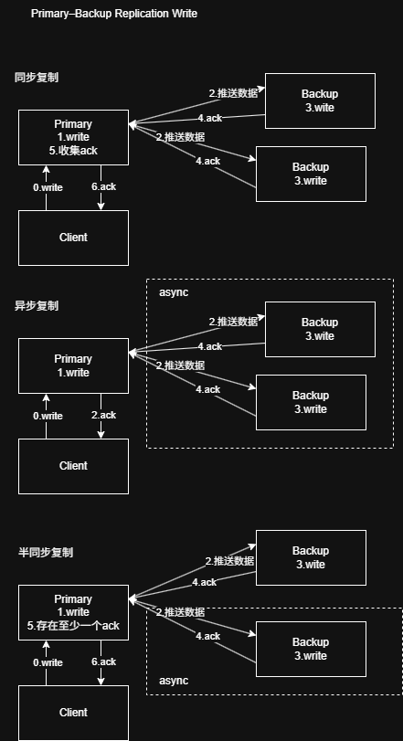
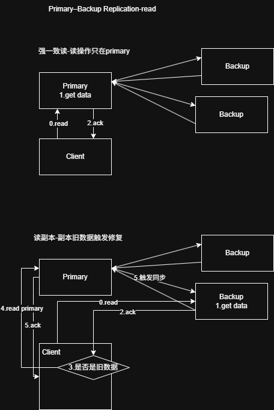

# Primary-Backup（主从复制）架构体系

## 1. 基本结构

Primary-Backup（主从复制）是最经典的分布式复制模型之一。

### 架构组成

* Primary（主节点）
* Backup / Replica（从节点，1~N 个）

```text
                +------------+
                |   Client   |
                +------------+
                       |
                       v
                +------------+
                |  Primary   |
                +------------+
                  /    |    \
                 /     |     \
                v      v      v
          +--------+ +--------+ +--------+
          |Backup1 | |Backup2 | |BackupN |
          +--------+ +--------+ +--------+
```

### 核心原则

* Primary 是唯一写入口（Single Writer）
* 所有写请求必须经过 Primary
* Primary 负责全局写入顺序（Ordering）
* Backup 负责复制和容灾

---

# 2. 写入流程

## 2.1 同步复制（Synchronous Replication）

### 流程

```text
Client
   |
   v
Primary
   |
   +--> Backup1
   |
   +--> Backup2
   |
   +--> BackupN
```

1. Client 发起写请求
2. Primary 写入 WAL / Log
3. Primary 将日志复制给 Backup
4. Backup 落盘并返回 ACK
5. Primary 收到多数派或全部 ACK
6. 返回 Client 成功

### 特点

* 强一致性
* 数据可靠性高
* 写延迟较高

---

## 2.2 异步复制（Asynchronous Replication）

### 流程

```text
Client
   |
   v
Primary
   |
 ACK
   |
   +--> Backup（异步）
```

1. Client 发起写请求
2. Primary 写入 WAL / Log
3. Primary 立即返回成功
4. 后台异步复制到 Backup

### 特点

* 写性能高
* 延迟低
* 存在数据丢失风险

---

## 2.3 半同步复制（Semi-Synchronous Replication）

### 流程

1. Client 发起写请求
2. Primary 写入 WAL / Log
3. Primary 同步复制到 Backup
4. 至少一个 Backup 返回 ACK
5. Primary 返回成功
6. 其余 Backup 异步同步

### 特点

* 性能与可靠性折中
* MySQL Semi-Sync 采用类似模式

---

# 3. 读取流程

## 3.1 强一致读

所有读写均访问 Primary。

```text
Client
   |
   v
Primary
```

### 优点

* 数据绝对最新
* 实现简单

### 缺点

* Primary 压力较大

---

## 3.2 副本读（Read Replica）

读请求访问 Backup。

```text
Client
   |
   v
Backup
```

### 问题

由于复制延迟（Replication Lag）：

```text
Primary --> 最新数据
Backup  --> 旧数据
```

可能读取到历史数据。

### 常见解决方案

#### Read Repair

发现副本落后时：

1. 从 Primary 拉取最新数据
2. 修复 Backup 数据
3. 后续读取使用最新副本

#### Read-After-Write

用户刚写入的数据强制从 Primary 读取。

---

# 4. Failover（故障切换）

当 Primary 宕机时，需要从 Backup 中选举新的 Primary。

## 4.1 外部协调选主

依赖：

* ZooKeeper
* etcd
* Consul

流程：

```text
Replica
   |
   v
ZooKeeper / etcd
   |
   v
New Primary
```

### 特点

* 实现简单
* 依赖外部协调系统

---

## 4.2 Raft-Based 选主

由协议内部完成：

* Leader Election
* Log Replication
* Failover

### 特点

* 不依赖外部协调器
* 一致性更强

---

# 5. 一致性模型

| 模型                     | 说明        |
| ---------------------- | --------- |
| Strong Consistency     | 同步复制 + 单主 |
| Sequential Consistency | 单主串行写     |
| Eventual Consistency   | 异步复制      |

---

# 6. 数据丢失场景

## Primary 宕机

### 情况1：未落盘

```text
Client
   |
Primary
   X Crash
```

数据仅存在内存：

```text
Data Lost
```

---

### 情况2：WAL 已落盘

```text
Primary
   |
 WAL fsync
   |
 Crash
```

可通过 WAL Replay 恢复。

---

## Backup 宕机

Backup 丢失的数据依赖：

```text
Primary -> Replication -> Backup
```

重新同步恢复。

---

# 7. Replication Lag（复制延迟）

由于：

* 网络延迟
* 磁盘 IO
* CPU 压力
* 流量突增

Backup 永远会落后于 Primary。

## 7.1 Log Replication

只同步日志：

```text
MySQL Binlog
PostgreSQL WAL
Raft Log
Kafka Partition Log
```

而非同步整个状态。

---

## 7.2 Batch Replication

批量发送日志：

```text
Entry1
Entry2
Entry3
...
```

变为：

```text
Batch(1~1000)
```

减少网络开销。

---

## 7.3 Pipeline Replication

连续发送：

```text
Entry100
Entry101
Entry102
...
```

无需等待单条 ACK。

---

## 7.4 Snapshot Catch-Up

副本落后过多时：

```text
Primary
    |
 Snapshot
    |
 Backup
```

先同步快照，再增量同步日志。

---

## 7.5 Quorum Working Set

在强一致系统中：

```text
Leader
Follower1
Follower2
```

只要多数派保持最新即可：

```text
2/3
```

系统即可继续工作。

---

# 8. Failover 数据一致性

Failover 时可能出现：

* 脑裂（Split Brain）
* 日志分叉
* 副本重新加入
* 未提交日志

---

## 8.1 WAL Replay（Crash Recovery）

### 核心思想

先写日志，再写数据页。

```text
Write
   |
 WAL fsync
   |
 ACK
   |
 Data Page Flush
```

### 恢复流程

```text
Crash
   |
 Restart
   |
 Replay WAL
```

### 作用

恢复本节点状态。

---

## 8.2 Log Reconciliation

解决日志分叉问题。

### 流程

1. 比较日志索引（Index）
2. 比较任期（Term）
3. 找到最后共同日志
4. 删除冲突日志
5. 同步正确日志

```text
Leader
1 2 3 4 5 6

Follower
1 2 3 4 X Y
```

恢复后：

```text
1 2 3 4 5 6
```

---

## 8.3 Quorum Commit

定义真正提交的数据。

### 提交规则

只有写入多数派（Quorum）的日志：

```text
N / 2 + 1
```

才算 Commit。

### 三节点示例

```text
Leader
Follower1
Follower2
```

写入：

```text
Leader OK
Follower1 OK
Follower2 Down
```

满足：

```text
2/3
```

日志即可提交。

### 作用

保证：

> Client 收到成功响应后，该日志不会丢失。

---

# 9. 工程实现方式

## WAL-Based Replication

Primary：

```text
Write WAL
```

Backup：

```text
Replay WAL
```

典型系统：

* MySQL
* PostgreSQL

---

## State Machine Replication

所有节点执行同样命令序列。

```text
Command Log
     |
     v
State Machine
```

典型系统：

* Raft
* Paxos
* ZooKeeper

---

## Raft-Based Replication

本质：

```text
Primary-Backup
+
Leader Election
+
Quorum Commit
+
Log Reconciliation
```

Raft 可以看作 Primary-Backup 的强化版本。

---

# 10. 总结

Primary-Backup 的核心思想：

> 通过「单点写入 + 多副本复制 + 故障切换」实现高可用存储系统。

核心能力包括：

* 单主写入
* 日志复制
* 副本同步
* 故障恢复
* 一致性保证

---

# 11. 一致性体系扩展

## Multi-Leader Replication

多个节点允许写入。

特点：

* 多主写
* 并发历史
* 冲突合并

代表系统：

* MySQL Multi-Primary
* Galera Cluster

---

## Leaderless Replication

无主复制。

特点：

* 无 Leader
* Quorum Read/Write
* 最终一致性

代表系统：

* Dynamo
* Cassandra
* Riak

---

## Paxos 系列

经典 Consensus 体系。

包括：

* Paxos
* Multi-Paxos
* EPaxos

特点：

* 强一致
* 多数派提交
* 数学证明严格

---

# 12. 分布式复制体系全景图

```text
                         Strong Consistency
                                 ↑
                                 |
           Raft / Paxos / ZAB / Chain Replication
                                 |
                                 |
                         Primary-Backup
                                 |
                                 |
                    Multi-Leader Replication
                                 |
                                 |
                Dynamo / Cassandra / Gossip
                                 |
                                 |
                                CRDT
                                 |
                                 ↓
                     Eventual Consistency
```
